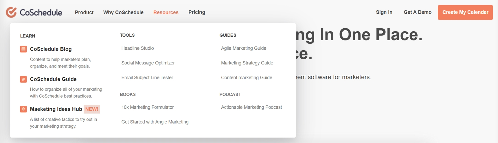
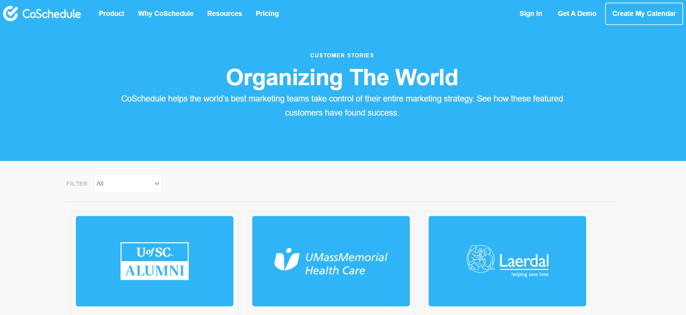
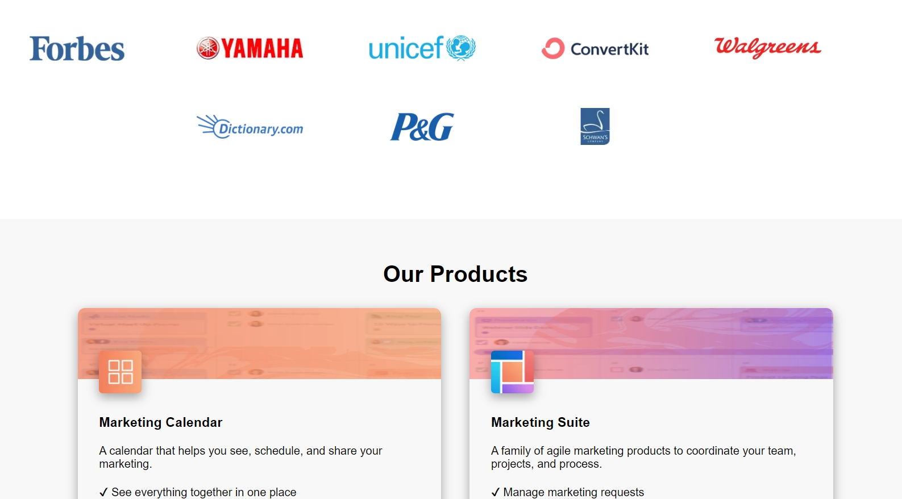
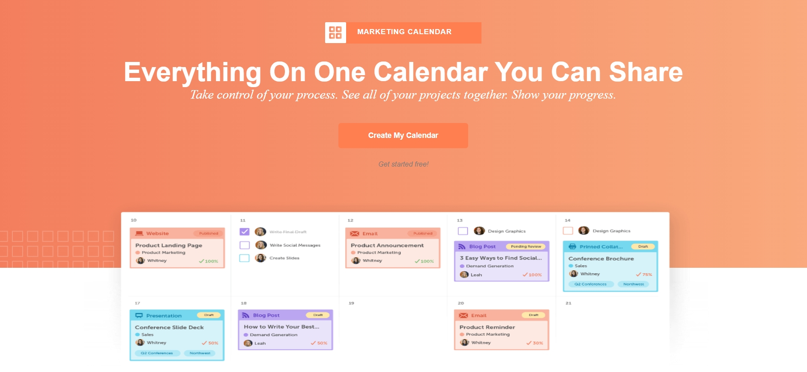
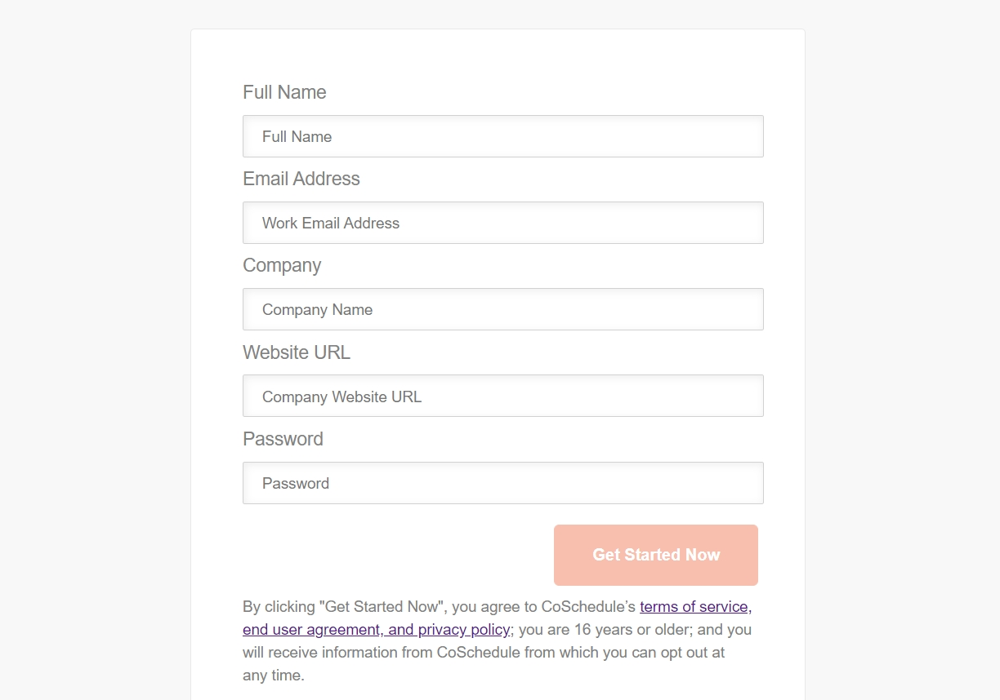
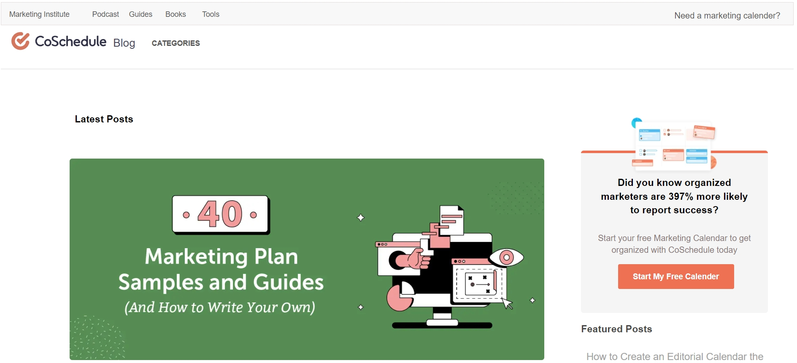
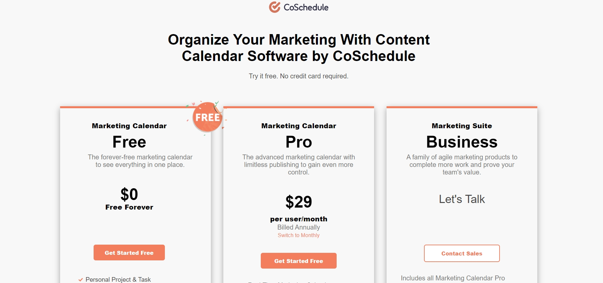
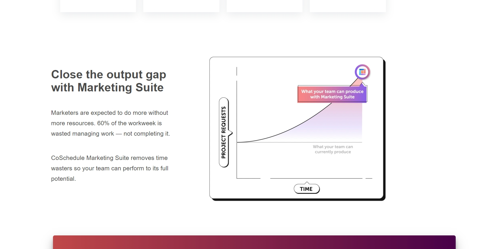

# CoSchedule clone

CoSchedule is an all-in-one platform for planning, organizing, and executing all things content marketing. It's easy to use drag-and-drop calendar interface makes it easy to collaborate and schedule all your projects in one place.
CLICK HERE TO VISIT THE WEBSITE: - https://shimmering-mandazi-2f003a.netlify.app/

## Tech Stack

<ul>
<li><b>HTML</b></li>
<li><b>CSS</b></li>
<li><b>JAVASCRIPT</b></li>
</ul>
 

 

## Navbar

The above picture is of the Navbar which is almost similar to the navbar of CoSchedule. I used HTML and CSS for styling the navbar. This navbar can be used for navigating on different pages of this website.

 

 

Case Studies page also consists of all the details of the Marketing and also has the functionality of filtering popular Marketing sites.

## Landing Page
 

 

The above picture is of the landing page which is almost similar to the landing page of CoSchedule. I used HTML and CSS for styling the website

## Calendar Page
 

 

The above page is Calender page. Here I managed to work on the HTML, CSS, and javascript related to the page.

## Signup Page
 

 

The above picture is of the Signup page which is almost similar to the Signup page of CoSchedule. I am involved in all the HTML, CSS, javascript, JSON, and DOM-related parts of the page and validation of the data given by the user and store the data in the local storage. After filling in all the inputs Click on getting Started Now this page will redirect to the Sign-in Page as shown below picture.

## CoSchedule Blog Page
 

 

This page contains blogs that are useful for marketing your company website. On the homepage, you can see all the categories of blogs. If you want to promote your website on any social media platform, please click on social media in categories and follow the related blogs on how to promote effectively. The below picture shows social media category blogs.

## Pricing Page
 

 

The Pricing Page is on the HTML and CSS.

## Marketing Suite Page
 

 

This page is on the HTML, CSS, and javascript.

## How do I Move Forward?

So, I started on Monday and I take a deadline i.e of Sunday. Finally, I completed on my given time.

So, in all this has been a great and wonderful experience for me.

